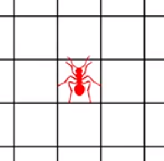
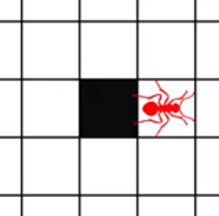
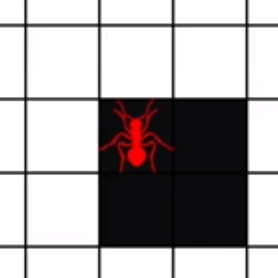
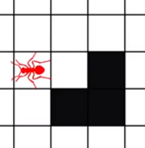

# Explications : la fourmi de Langton et les Papers animés

## La fourmi de Chris Langton

Bienvenue à tous dans cette petite séance de découverte de la programmation !

Nous allons utiliser le concept de "Papers animés" pour programmer (en partie) les mouvements de la fourmi de Langton.

Pas de panique si vous n'avez rien compris, c'est normal, à la fin de la séance, tout sera plus clair et surtout, vous aurez appris certains concepts clés qui font partie des socles de bases de la programmation.

Pour commencer, nous allons regarder une vidéo (+- 15 minutes) sur le sujet de la fourmi de Langton. Soyez bien attentifs ;-)

https://www.youtube.com/watch?v=qZRYGxF6D3w

([Dropbox mov](https://www.dropbox.com/s/56z2ujebbg5u8yu/La%20fourmi%20de%20Langton%20-%20Science%20%C3%A9tonnante%20%2321.mov?dl=0))

([Dropbox mp4](https://www.dropbox.com/s/64kqxl76el77i7p/La%20fourmi%20de%20Langton%20-%20Science%20%C3%A9tonnante%20%2321.mp4?dl=0))

Nous venons de voir tout ce champ d'exploration ouvert par cet intriguant petit programme de simulation d'une fourmi de Chris Langton.

Ne pourrions-nous pas aborder la programmation avec pour défi de reprogrammer cet algorithme ?

Après tout, les règles de base sont simples :
- si la case sous la fourmi n'est pas coloriée, elle colorie cette case, puis elle part à droite (en avançant d'une seule case) ;

- si la case sous la fourmi est coloriée, elle efface la couleur de cette case, puis elle part à gauche (en avançant d'une seule case).

## Les Papers

Définissons le concept de "Paper". Il s'agit d'une grille dans laquelle on peut dessiner en coloriant des cases.

Voici un exemple de programme (codé en langage C) qui permet de créer et afficher un paper dans lequel on a dessiné un coeur avec des carrés (une sorte de "pixel art" informatique) :

**! Vous pouvez appuyer sur "Run" pour exécuter ce code et visualiser le "Paper" obtenu. Inutile de comprendre le programme maintenant, nous allons y venir progressivement par la suite.**

@[paper_coeur]({"stubs": ["main.c"],"command": "sh /project/target/run.sh", "project" : "paper_coeur"})

## Les Papers animés

Le programme C :

@[fourmi]({"stubs": ["main.c"],"command": "sh /project/target/run.sh", "project" : "fourmi"})

